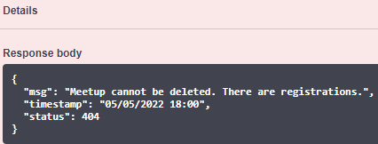

#  WoMakersCode - Bootcamp Java 🦋

## RestAPI para agendamento de meetups

API desenvolvida no bootcamp back-end Java da WoMakersCode, cujo objetivo é registrar eventos e seus respectivos participantes.

---

### Status
>Concluído ✔️

>Vídeo: https://www.youtube.com/watch?v=MOgbZ4KyACU

---

### Tecnologias 🖥️

* Java 11
* Spring Boot 2.6.6
* Spring Data JPA
* Spring Security
* Gradle
* MySQL
* H2 Database
* TDD - Test Driven Development
* JUnit 5
* Mockito
* Azure functions
* Swagger

---

### Como utilizar a aplicação 🤔

* 1 - A aplicação encontra-se hospedada na Azure, disponível na seguinte URL: https://microservice-meetup.azurewebsites.net/swagger-ui/#/

* 2 - Para acessar os endpoints, crie uma nova conta e insira um e-mail válido, como mostra o exemplo

* 3 - Após a criação da conta, verifique seu e-mail

* 4 - A aplicação encontra-se implementada com o Spring Security. Dessa forma, é necessário criar um token à partir da nova conta, para acessar os endpoints que necessitam de autenticação. Siga os seguites passos para a criação do token:

    * 4.1 - Acesse a ferramenta **Postman**;
    * 4.2 - Em seguida, insira a seguinte url em _Enter request URL_ e selecione o método `POST`: `https://microservice-meetup.azurewebsites.net/login`;
      
      
    
    * 4.3 - Para encontrar seu token, acesse a aba _Headers_ e encontre a key _Authorization_ com seu respectivo value(token);

      
      
      _Obs: é importante ressaltar que o token tem duração de 16 minutos. Logo após a esse intervalo, o token expirará e dessa forma, será ncessário gerar um novo     token, seguindo os mesmos passos da seção 4._

* 5 - Com o token em mãos, basta voltar ao **Swagger**, clicar no botão _Authorize_ e inserir o token

* 6 - Após seguir os passos, você poderá acessar os endpoints e se cadastrar em um meetup! Segue como exemplo, uma demonstração de como se registrar em um determinado evento:
  
  * 6.1 - Por padrão, a aplicação está com 2 eventos cadastrados. No exemplo, será demonstrado um cadastro em um evento já inserido no sistema, mas você também pode criar um novo evento com o endpoint `/api/meetups/registerMeetup`. É opcional!;
     
  * 6.2 - Vá até o endpoint `/api/meetups/registerRegistration/{meetupId}`. Em seguida, insira o id do meetup, o _registration number_ e clique em **Execute**;

  * 6.3 - O retorno das informações será enviado por e-mail;

 * 7 - Os demais endpoints estarão disponíveis para serem acessados e testados. :)

---

### Diagrama do sistema :bar_chart:

<h4><i> clique na imagem para uma melhor visualização </i></h4>

---

### Features 💡

* **Exceções personalizadas**: O código foi programado para lançar exceções descritivas, que auxiliam o programador a encontrar a origem do problema. Alguns exemplos do uso de exceções personalizadas são:
    
  
  
  

- **Lista de exceções referentes à validação**:

  

- **Relação many-to-many**: Já que um registration pode se cadastrar em vários meetups e, vários meetups podem ter muitos registrations, a relação many-to-many torna-se necessária, gerando, dessa forma, uma terceira tabela.

- **Envio de e-mails**: Há envio de e-mails com o Spring Mail no momento em que um usuário cria um cadastro e também quando o mesmo se registra em um meetup.

- **Implementação do Spring Security com token JWT**: para maior segurança, foi implementado o Spring Security e dessa forma, o usuário deverá estar autenticado para acessar os endpoints.

- **Representação do sistema por meio de um diagrama**: Para um maior entendimento a respeito do sistema como um todo, foi realizado um diagrama representando todo o fluxo das ações. O mesmo encontra-se logo acima, em _Diagrama do sistema_. 

---
### Melhorias

* Usar o _registration number_ como id da tabela de Registration.

---
### Checklist ✔️

- [x] Implementação da classe Registration
- [x] Implementação da classe Meetup
- [x] Implementação da camada service
- [x] Implementação da camada controller
- [x] Implementação do repository
- [x] Implementação de DTO's
- [x] Adicionar MySQL ao projeto
- [x] Adicionar LOGs à aplicação
- [x] Tratamento de exceptions
- [x] Tratamento de validação em Registration
- [x] Tratamento de validação em Meetup
- [x] Envio de e-mail ao registrar o cadastro
- [x] Envio de e-mail ao registrar em um meetup
- [ ] Número de registro como _auto generated_ [opcional]
- [x] Adicionar Spring Security com token JWT
- [x] Swagger - https://microservice-meetup.azurewebsites.net/swagger-ui/#/
- [x] Desenhar diagrama do sistema
- [x] Testes locais via postman
- [x] Deploy no Azure

### Checklist para testes 🧪

- [x] Meetup | Testes do repository
- [x] Meetup | Testes do controller
- [x] Meetup | Testes do service
- [x] Registration | Testes do repository
- [x] Registration | Testes do controller
- [x] Registration | Testes do service

